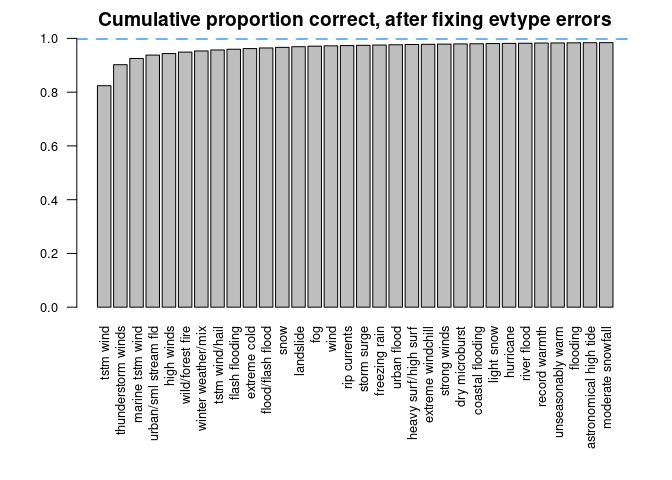
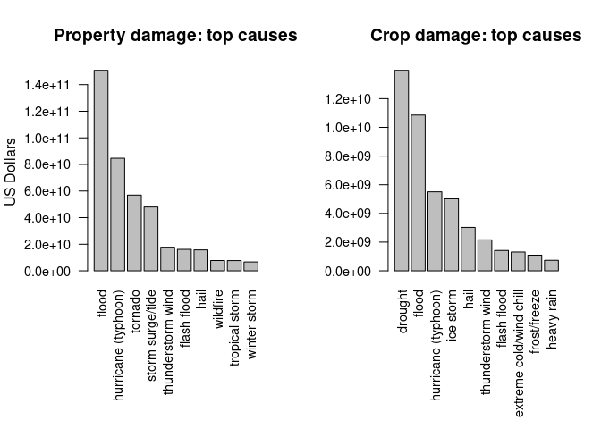

*Most recent update: 2022-01-03*

# Synopsis
*Immediately after the title, there should be a synopsis which describes and 
summarizes your analysis in at most 10 complete sentences.*

# Data Processing

We'll load libraries first.


```r
# One function from data.table is also required, "fread". We won't load the
# entire package because its namespace overlaps some other functions we use.
suppressPackageStartupMessages(library(tidyverse))
suppressPackageStartupMessages(library(kableExtra))  # table formatting tools

# Set global table styling options here by overriding kable()
kable <- function(data, ...) {
    knitr::kable(data, format.args = list(big.mark = ","), ...) %>% 
        kable_classic(full_width=FALSE, position="left")
}
```

Next we load the data, rename two variables with cumbersome names,
remove two variables which contain no informatin, and standardize the values 
of `evtype` to lowercase with no extra spaces.


```r
df <- as_tibble(data.table::fread(file = "repdata_data_StormData.csv.bz2"))
df <- rename(df, state_num = STATE__, longitude_e = LONGITUDE_)
names(df) <- tolower(names(df))
# these variables are all 0 and all NA, respectively
df <- select(df, -c(county_end, countyendn))

# standardize `evtype` to lowercase, removing spaces at beginning and end
# and removing extra internal spaces
df$evtype <- tolower(str_squish(df$evtype))
```

## Correcting `propdmgexp` and `cropdmgexp`

In the raw data, damage amounts are represented in an unusual way. They are 
expressed in scientific notation, with the base and exponent stored in 
separate variables.

The exponents, `propdmgexp` and `cropdmgexp`,  are supposed to
represent a power of 10, which is multiplied by `propdmg` or `cropdmg`
respectively to express a final damage amount. However, they actually
contain unusual character values:


```r
sort(union(unique(df$propdmgexp), unique(df$cropdmgexp)))
```

```
##  [1] ""  "-" "?" "+" "0" "1" "2" "3" "4" "5" "6" "7" "8" "B" "h" "H" "k" "K" "m"
## [20] "M"
```

After some investigation, it appears varying data entry standards or data
entry error has resulted in this state of affairs. A power of 10 will be
assigned to replace each of these symbols.
[*For a more complete discussion, see [this Rpubs document](https://rstudio-pubs-static.s3.amazonaws.com/58957_37b6723ee52b455990e149edde45e5b6.html).*]

* `empty string`: 0
* `+` or `?`: 1
* `0-9`: 10
* `hH`: 100   "hundred"
* `kK`: 1000  "kilo"
* `mM`: 10^6  "million"
* `bB`: 10^9  "billion"
* `-`: NA 


```r
# Perform the substitution described above
old <- c("-", "?", "+", "0", "1", "2", "3", "4", "5", "6", "7", "8", "B", "H", "K", "M", "")
new <- c(NA,   1,   1,   10,  10,  10,  10,  10,  10,  10,  10,  10, 1e9, 1e2, 1e3, 1e6, 0)

ctmp <- toupper(df$cropdmgexp)
ptmp <- toupper(df$propdmgexp)
cnew <- rep(NA_integer_, length(ctmp)) # new vectors will be integers
pnew <- rep(NA_integer_, length(ptmp))

for (i in 1:length(old)) {
    cnew[ctmp == old[[i]]] <- new[[i]]
    pnew[ptmp == old[[i]]] <- new[[i]]
}

df$cropdmgexp <- cnew
df$propdmgexp <- pnew
rm(ctmp, ptmp, cnew, pnew, old, new, i)
```

## Fixing `evtype`

`evtype` may be the most important variable in our dataset. It is the
variable that categorizes each event as "tornado", "flood" and so forth.
Later we'll use `evtype` to
aggregate human and financial damage for each type of weather event and it's
important that they reflect the categories we think they do.

In the NOAA documentation there are 48 official `evtype` values, corresponding
to the various weather events they wish to record data for.

In the dataset however, 883 unique values exist
after standardizing to lowercase. An examination of the values
shows this to have probably resulted from manual data entry. For example,
here we list types relating to blizzards.


```r
df %>% 
    count(evtype) %>% 
    arrange(desc(n)) %>% 
    filter(str_detect(evtype, "blizzard")) %>% 
    head(n=7) %>% 
    kable(caption = 'Counts of blizzard-related evtypes')
```

<table class=" lightable-classic" style='font-family: "Arial Narrow", "Source Sans Pro", sans-serif; width: auto !important; '>
<caption>Counts of blizzard-related evtypes</caption>
 <thead>
  <tr>
   <th style="text-align:left;"> evtype </th>
   <th style="text-align:right;"> n </th>
  </tr>
 </thead>
<tbody>
  <tr>
   <td style="text-align:left;"> blizzard </td>
   <td style="text-align:right;"> 2,719 </td>
  </tr>
  <tr>
   <td style="text-align:left;"> high wind/blizzard </td>
   <td style="text-align:right;"> 6 </td>
  </tr>
  <tr>
   <td style="text-align:left;"> heavy snow/blizzard </td>
   <td style="text-align:right;"> 3 </td>
  </tr>
  <tr>
   <td style="text-align:left;"> blizzard and extreme wind chil </td>
   <td style="text-align:right;"> 2 </td>
  </tr>
  <tr>
   <td style="text-align:left;"> blizzard/heavy snow </td>
   <td style="text-align:right;"> 2 </td>
  </tr>
  <tr>
   <td style="text-align:left;"> ground blizzard </td>
   <td style="text-align:right;"> 2 </td>
  </tr>
  <tr>
   <td style="text-align:left;"> blizzard and heavy snow </td>
   <td style="text-align:right;"> 1 </td>
  </tr>
</tbody>
</table>

We can see that `"blizzard"` labels most of the observations, with a small number of
other observations given similar-sounding labels. These observations should probably be
a part of `"blizzard"`. With over 800 types in the dataset, We'd like to know 
if this example represents a systematic problem. 

### What proportion of `evtypes` are problematic?

We constructed a list of official evtypes from NOAA documentation and
stored it in `evtypes.txt`. We wish to know
**what proportion of records have a non-standard `evtype` value?**


```r
types <- tolower(readLines("evtypes.txt")) # a vector of standard evtypes
df %>% filter(! evtype %in% types) %>% nrow() / nrow(df)
```

```
## [1] 0.2958472
```
**About 30% of the data is using some other label for `evtype`.** This is
a significant number and could certainly skew our analysis.
e.g. if one major event type
were split into many smaller types it might no longer appear to be a major
cause of damage.

What we don't know yet is how these 30% of records are distributed among 
non-standard `evtypes`.  i.e. Are they evenly distributed amongst the thousand
or so values (a worst-case scenario) or do a small number of strings
represent the majority of these problematic observations?

### How many non-standard `evtypes` do we need to fix?

We'll next group non-standard observations by their `evtype` and count the
observations by type. We'll also sort these counts and calculate a cumulative
proportion of the observations.


```r
df %>% 
    filter(! evtype %in% types) %>% 
    count(evtype) %>% 
    arrange(desc(n)) %>%  
    mutate(proportion = n / sum(n), cumulative = cumsum(proportion)) %>% 
    slice_max(n, n=4) %>% kable(caption = "Top four errors in evtype")
```

<table class=" lightable-classic" style='font-family: "Arial Narrow", "Source Sans Pro", sans-serif; width: auto !important; '>
<caption>Top four errors in evtype</caption>
 <thead>
  <tr>
   <th style="text-align:left;"> evtype </th>
   <th style="text-align:right;"> n </th>
   <th style="text-align:right;"> proportion </th>
   <th style="text-align:right;"> cumulative </th>
  </tr>
 </thead>
<tbody>
  <tr>
   <td style="text-align:left;"> tstm wind </td>
   <td style="text-align:right;"> 219,946 </td>
   <td style="text-align:right;"> 0.8239468 </td>
   <td style="text-align:right;"> 0.8239468 </td>
  </tr>
  <tr>
   <td style="text-align:left;"> thunderstorm winds </td>
   <td style="text-align:right;"> 20,850 </td>
   <td style="text-align:right;"> 0.0781069 </td>
   <td style="text-align:right;"> 0.9020536 </td>
  </tr>
  <tr>
   <td style="text-align:left;"> marine tstm wind </td>
   <td style="text-align:right;"> 6,175 </td>
   <td style="text-align:right;"> 0.0231324 </td>
   <td style="text-align:right;"> 0.9251860 </td>
  </tr>
  <tr>
   <td style="text-align:left;"> urban/sml stream fld </td>
   <td style="text-align:right;"> 3,392 </td>
   <td style="text-align:right;"> 0.0127069 </td>
   <td style="text-align:right;"> 0.9378929 </td>
  </tr>
</tbody>
</table>

**The four most common errors represent almost 94% of all errors.**

Let's pick a nice round number of observations as a cutoff value. 
We'll count how many non-standard `evtype` strings label 100 or more observations
in the dataset. As a reminder, there are 902297 observations in total.


```r
fixtypes <- df %>% 
    filter(! evtype %in% types) %>%
    count(evtype) %>% 
    arrange(desc(n)) %>% 
    filter(n >= 100) %>% 
    pull(evtype)
length(fixtypes)
```

```
## [1] 32
```

This is good news, we won't have to fix over 800 errors. **Fixing
the 32 most common** should ensure a much more accurate analysis. Let's calculate
what proportion of observations will be correct, if we fix `evtypes` with
100 or more observations.


```r
df %>% 
    filter(! evtype %in% types) %>% 
    count(evtype) %>% 
    arrange(desc(n)) %>% 
    mutate(proportion = n / sum(n), cumulative = cumsum(proportion)) %>% 
    filter(n > 99, n <=101) %>% kable()
```

<table class=" lightable-classic" style='font-family: "Arial Narrow", "Source Sans Pro", sans-serif; width: auto !important; '>
 <thead>
  <tr>
   <th style="text-align:left;"> evtype </th>
   <th style="text-align:right;"> n </th>
   <th style="text-align:right;"> proportion </th>
   <th style="text-align:right;"> cumulative </th>
  </tr>
 </thead>
<tbody>
  <tr>
   <td style="text-align:left;"> moderate snowfall </td>
   <td style="text-align:right;"> 101 </td>
   <td style="text-align:right;"> 0.0003784 </td>
   <td style="text-align:right;"> 0.9843337 </td>
  </tr>
</tbody>
</table>

**98.4% of our problematic records will be corrected after fixing the top 32.**
Let's visualize the situation by plotting the cumulative proportion of correct
`evtypes`.


```r
x <- df %>% 
    filter(! evtype %in% types) %>% 
    count(evtype) %>% 
    arrange(desc(n)) %>%  
    mutate(proportion = n / sum(n), cumulative = cumsum(proportion)) %>% 
    head(32) 
tmp <- x$cumulative
names(tmp) <- x$evtype
par(mar = c(9,4,2,2), cex.axis = .8)
barplot(tmp, las=2, ylim=c(0,1),
         main="Cumulative proportion correct, after fixing evtype errors")
abline(h=1, lty=2, col='dodgerblue2', lwd=2.5)
```

<!-- -->

Fixing `tstm wind` alone will correct over 80% of the records, and then
we see rapidly diminishing returns.

Since evtype errors represent about 30% of all data, correcting these errors
to about 98.4% accuracy (the top 32 errors) will result in an overall `evtype`
accuracy of about `(1 - 0.3 * (1 - .984)) * 100 ~= ` 
99.5% for the entire dataset. Improving
further would represent vastly dimished returns, so we'll consider this
an acceptable improvement from about 70% correct.

### Fixing the selected `evtypes`

What we will do is work through these 32 types systematically and assign them
the correct `evtype`, using the NOAA documentation and some common sense to
place them in the correct category.

The rest of the non-standard labels we will disregard for having too
small an effect on the analysis to matter. Let's first look at the labels
we'll fix.


```r
kable(matrix(fixtypes, nrow = 8), caption = "The 32 most important evtypes to correct")
```

<table class=" lightable-classic" style='font-family: "Arial Narrow", "Source Sans Pro", sans-serif; width: auto !important; '>
<caption>The 32 most important evtypes to correct</caption>
<tbody>
  <tr>
   <td style="text-align:left;"> tstm wind </td>
   <td style="text-align:left;"> flash flooding </td>
   <td style="text-align:left;"> storm surge </td>
   <td style="text-align:left;"> light snow </td>
  </tr>
  <tr>
   <td style="text-align:left;"> thunderstorm winds </td>
   <td style="text-align:left;"> extreme cold </td>
   <td style="text-align:left;"> freezing rain </td>
   <td style="text-align:left;"> hurricane </td>
  </tr>
  <tr>
   <td style="text-align:left;"> marine tstm wind </td>
   <td style="text-align:left;"> flood/flash flood </td>
   <td style="text-align:left;"> urban flood </td>
   <td style="text-align:left;"> river flood </td>
  </tr>
  <tr>
   <td style="text-align:left;"> urban/sml stream fld </td>
   <td style="text-align:left;"> snow </td>
   <td style="text-align:left;"> heavy surf/high surf </td>
   <td style="text-align:left;"> record warmth </td>
  </tr>
  <tr>
   <td style="text-align:left;"> high winds </td>
   <td style="text-align:left;"> landslide </td>
   <td style="text-align:left;"> extreme windchill </td>
   <td style="text-align:left;"> unseasonably warm </td>
  </tr>
  <tr>
   <td style="text-align:left;"> wild/forest fire </td>
   <td style="text-align:left;"> fog </td>
   <td style="text-align:left;"> strong winds </td>
   <td style="text-align:left;"> flooding </td>
  </tr>
  <tr>
   <td style="text-align:left;"> winter weather/mix </td>
   <td style="text-align:left;"> wind </td>
   <td style="text-align:left;"> dry microburst </td>
   <td style="text-align:left;"> astronomical high tide </td>
  </tr>
  <tr>
   <td style="text-align:left;"> tstm wind/hail </td>
   <td style="text-align:left;"> rip currents </td>
   <td style="text-align:left;"> coastal flooding </td>
   <td style="text-align:left;"> moderate snowfall </td>
  </tr>
</tbody>
</table>

Now we'll fix these incorrect labels by reassigning the observation to the
correct `evtype`.


```r
# map official evtypes to a vector of some incorrect names for that type
fixlist <- list(
    "thunderstorm wind" = c("tstm wind", "thunderstorm winds", "tstm wind/hail", 
                            "wind", "dry microburst"),
    "marine thunderstorm wind" = c("marine tstm wind"),
    "flood" = c("urban/sml stream fld", "flood/flash flood", "urban flood",
                "river flood", "flooding"),
    "flash flood" = c("flash flooding"),
    "coastal flood" = c("coastal flooding"),
    "high wind" = c("high winds"),
    "strong wind" = c("strong winds"),
    "wildfire" = c("wild/forest fire"),
    "winter weather" = c("winter weather/mix"),
    "extreme cold/wind chill" = c("extreme cold", "extreme windchill"),
    "heavy snow" = c("snow", "light snow", "moderate snowfall"),
    "debris flow" = c("landslide"),
    "dense fog" = c("fog"),
    "rip current" = c("rip currents"),
    "excessive heat" = c("unseasonably warm", "record warmth"),
    # from docs: "..caused by any combination of...high astronomical tide..."
    "storm surge/tide" = c("storm surge", "astronomical high tide"),  
    "high surf" = c("heavy surf/high surf"),
    "winter weather" = c("freezing rain"),
    "hurricane (typhoon)" = c("hurricane")
)

tmp <- df$evtype

# replace all the bad evtypes with official evtypes
for (officialtype in names(fixlist)) {
    for (badtype in fixlist[[officialtype]]) {
        tmp[grep(pattern = badtype, x = tmp)] <- officialtype
    }
}
df$evtype <- tmp
rm(tmp)
```

Previously, almost 30% of records had an incorrect `evtype`. Let's recalculate 
that proportion.

```r
df %>% filter(! evtype %in% types) %>% nrow() / nrow(df)
```

```
## [1] 0.003188529
```

Excellent! Now only 0.3% of records have some unusual `evtype` from data
entry errors, or in other words **`evtype` is now almost 99.7% correct.** Earlier
we estimated we'd see 99.5% correct, so this is reasonable.

#### A final test: dollar amounts

Let's make one more test. It's *possible* these small number of 
observations are actually large in terms of human or financial damage. Let us
compare the sum of fatalities, injuries, property damage, and crop damage of the
remaining uncorrected records to the whole.


```r
results <- df %>% 
    mutate(property = propdmg*propdmgexp, crops = cropdmg*cropdmgexp) %>% 
    group_by("standard_evtypes" = evtype %in% types) %>% 
    summarise(across(c(fatalities, injuries, property, crops),
                     ~sum(., na.rm=TRUE))) %>% 
    t()
results <- results[-1, ]
colnames(results) <- c("sum.non.standard", "sum.standard")
as_tibble(results) %>% 
    mutate(non.standard.proportion = sum.non.standard / (sum.non.standard + sum.standard),
           class = rownames(results)) %>% 
    select(class, everything()) %>% 
    kable(caption = "Proportions of total damage represented by non-standard evtypes")
```

<table class=" lightable-classic" style='font-family: "Arial Narrow", "Source Sans Pro", sans-serif; width: auto !important; '>
<caption>Proportions of total damage represented by non-standard evtypes</caption>
 <thead>
  <tr>
   <th style="text-align:left;"> class </th>
   <th style="text-align:right;"> sum.non.standard </th>
   <th style="text-align:right;"> sum.standard </th>
   <th style="text-align:right;"> non.standard.proportion </th>
  </tr>
 </thead>
<tbody>
  <tr>
   <td style="text-align:left;"> fatalities </td>
   <td style="text-align:right;"> 500 </td>
   <td style="text-align:right;"> 14,645 </td>
   <td style="text-align:right;"> 0.0330142 </td>
  </tr>
  <tr>
   <td style="text-align:left;"> injuries </td>
   <td style="text-align:right;"> 1,718 </td>
   <td style="text-align:right;"> 138,810 </td>
   <td style="text-align:right;"> 0.0122253 </td>
  </tr>
  <tr>
   <td style="text-align:left;"> property </td>
   <td style="text-align:right;"> 5,921,397,600 </td>
   <td style="text-align:right;"> 421,397,322,440 </td>
   <td style="text-align:right;"> 0.0138571 </td>
  </tr>
  <tr>
   <td style="text-align:left;"> crops </td>
   <td style="text-align:right;"> 1,289,044,280 </td>
   <td style="text-align:right;"> 47,815,150,230 </td>
   <td style="text-align:right;"> 0.0262512 </td>
  </tr>
</tbody>
</table>

With these non-standard cases making up at most 3.3% of the total damage, the dataset
is in much better condition than it was in raw form.
We'll continue the analysis with this imperfect but much-improved dataset, 
assuming that this small proportion of error won't significantly skew our results.

## Results

### Across the United States, which types of events (as indicated in the EVTYPE variable) are most harmful with respect to population health?


Here we sum the fatalities and injuries across `evtype`, select the ten largest
sums, and then plot the results.


```r
top_fatalities <- df %>% 
    group_by(evtype) %>% 
    summarise(fatalities = sum(fatalities, na.rm = TRUE)) %>% 
    arrange(desc(fatalities)) %>% 
    slice_head(n = 10)

top_injuries <- df %>% 
    group_by(evtype) %>% 
    summarise(injuries = sum(injuries, na.rm = TRUE)) %>% 
    arrange(desc(injuries)) %>% 
    slice_head(n = 10)
```


```r
par(mfrow = c(1,2), mar=c(c(8, 4, 4, 2) + 0.1), cex.axis=.9)
barplot(top_fatalities$fatalities, names.arg = top_fatalities$evtype, las=2,
        main="Fatalities: top causes")
barplot(top_injuries$injuries, names.arg = top_injuries$evtype, las=2,
        main="Injuries: top causes")
```

<!-- -->

In terms of both fatalities and injuries, **tornadoes are the most destructive
events to human health** in this dataset. 


```r
kable(list(data.frame(rank = 1:10), top_fatalities, data.frame(),data.frame(), top_injuries),
      caption = "Top causes, fatalities & injuries")
```

<table class="kable_wrapper lightable-classic" style='font-family: "Arial Narrow", "Source Sans Pro", sans-serif; width: auto !important; '>
<caption>Top causes, fatalities &amp; injuries</caption>
<tbody>
  <tr>
   <td> 

<table>
 <thead>
  <tr>
   <th style="text-align:right;"> rank </th>
  </tr>
 </thead>
<tbody>
  <tr>
   <td style="text-align:right;"> 1 </td>
  </tr>
  <tr>
   <td style="text-align:right;"> 2 </td>
  </tr>
  <tr>
   <td style="text-align:right;"> 3 </td>
  </tr>
  <tr>
   <td style="text-align:right;"> 4 </td>
  </tr>
  <tr>
   <td style="text-align:right;"> 5 </td>
  </tr>
  <tr>
   <td style="text-align:right;"> 6 </td>
  </tr>
  <tr>
   <td style="text-align:right;"> 7 </td>
  </tr>
  <tr>
   <td style="text-align:right;"> 8 </td>
  </tr>
  <tr>
   <td style="text-align:right;"> 9 </td>
  </tr>
  <tr>
   <td style="text-align:right;"> 10 </td>
  </tr>
</tbody>
</table>

 </td>
   <td> 

<table>
 <thead>
  <tr>
   <th style="text-align:left;"> evtype </th>
   <th style="text-align:right;"> fatalities </th>
  </tr>
 </thead>
<tbody>
  <tr>
   <td style="text-align:left;"> tornado </td>
   <td style="text-align:right;"> 5,633 </td>
  </tr>
  <tr>
   <td style="text-align:left;"> excessive heat </td>
   <td style="text-align:right;"> 1,943 </td>
  </tr>
  <tr>
   <td style="text-align:left;"> thunderstorm wind </td>
   <td style="text-align:right;"> 1,454 </td>
  </tr>
  <tr>
   <td style="text-align:left;"> flash flood </td>
   <td style="text-align:right;"> 978 </td>
  </tr>
  <tr>
   <td style="text-align:left;"> heat </td>
   <td style="text-align:right;"> 937 </td>
  </tr>
  <tr>
   <td style="text-align:left;"> lightning </td>
   <td style="text-align:right;"> 816 </td>
  </tr>
  <tr>
   <td style="text-align:left;"> rip current </td>
   <td style="text-align:right;"> 577 </td>
  </tr>
  <tr>
   <td style="text-align:left;"> flood </td>
   <td style="text-align:right;"> 554 </td>
  </tr>
  <tr>
   <td style="text-align:left;"> avalanche </td>
   <td style="text-align:right;"> 224 </td>
  </tr>
  <tr>
   <td style="text-align:left;"> winter storm </td>
   <td style="text-align:right;"> 206 </td>
  </tr>
</tbody>
</table>

 </td>
   <td> 

<table>
<tbody>
  <tr>

  </tr>
</tbody>
</table>

 </td>
   <td> 

<table>
<tbody>
  <tr>

  </tr>
</tbody>
</table>

 </td>
   <td> 

<table>
 <thead>
  <tr>
   <th style="text-align:left;"> evtype </th>
   <th style="text-align:right;"> injuries </th>
  </tr>
 </thead>
<tbody>
  <tr>
   <td style="text-align:left;"> tornado </td>
   <td style="text-align:right;"> 91,346 </td>
  </tr>
  <tr>
   <td style="text-align:left;"> thunderstorm wind </td>
   <td style="text-align:right;"> 11,526 </td>
  </tr>
  <tr>
   <td style="text-align:left;"> flood </td>
   <td style="text-align:right;"> 6,902 </td>
  </tr>
  <tr>
   <td style="text-align:left;"> excessive heat </td>
   <td style="text-align:right;"> 6,542 </td>
  </tr>
  <tr>
   <td style="text-align:left;"> lightning </td>
   <td style="text-align:right;"> 5,230 </td>
  </tr>
  <tr>
   <td style="text-align:left;"> heat </td>
   <td style="text-align:right;"> 2,100 </td>
  </tr>
  <tr>
   <td style="text-align:left;"> ice storm </td>
   <td style="text-align:right;"> 1,975 </td>
  </tr>
  <tr>
   <td style="text-align:left;"> flash flood </td>
   <td style="text-align:right;"> 1,777 </td>
  </tr>
  <tr>
   <td style="text-align:left;"> wildfire </td>
   <td style="text-align:right;"> 1,456 </td>
  </tr>
  <tr>
   <td style="text-align:left;"> hail </td>
   <td style="text-align:right;"> 1,361 </td>
  </tr>
</tbody>
</table>

 </td>
  </tr>
</tbody>
</table>


#### Hurricanes?

There appears to be something missing in the above graphs. Knowing something of 
destructive US weather events one must ask **"Where are the hurricanes?"**

There is an important note in the FAQ:

>The fatalities, injuries, and damage amounts appearing in tropical cyclone events are
attributed only to wind damage experienced in the coastal counties/parishes listed. Other
tropical cyclone related events such as tornadoes and flooding are listed within their
separate event types.

**i.e. the deaths and damage from hurricanes have deliberately been split up into 
multiple evtypes** and will show up as part of floods, lightning, wind, *etc.*
Hurricane-spawned tornadoes are also included in the tornado events graphed above.
From the point of view of this dataset, hurricanes may be understood as a
'meta-event' that *causes* other events.

It is also worth noting that some similar events have different official
`evtypes`, e.g. `excessive heat` and `heat`, both of which show up in
the graphs above.  We will leave this as is, having verified that they
represent different categories in the NOAA documentation.

#### Across the United States, which types of events have the greatest economic consequences?

We proceed as earlier, summing property and crop damage across all evtypes.


```r
top_property_dmg <- df %>% 
    group_by(evtype) %>% 
    summarise(property = sum(propdmg * propdmgexp, na.rm = TRUE)) %>% 
    arrange(desc(property)) %>% 
    slice_head(n = 10)
top_crop_dmg <- df %>% 
    group_by(evtype) %>% 
    summarise(crop = sum(cropdmg * cropdmgexp, na.rm = TRUE)) %>% 
    arrange(desc(crop)) %>% 
    slice_head(n = 10)

par(mfrow=c(1,2), mar=c(c(9, 5, 4, 2) + 0.1), cex.axis=.9, mgp = c(4, 1, 0))
barplot(top_property_dmg$property, names.arg = top_property_dmg$evtype, las=2,
        main="Property damage: top causes", ylab = "US Dollars")
barplot(top_crop_dmg$crop, names.arg = top_crop_dmg$evtype, las=2,
        main="Crop damage: top causes")
```

<!-- -->


```r
kable(list(data.frame(rank = 1:10), top_property_dmg, data.frame(),data.frame(), 
           top_crop_dmg),
      caption = "Top causes, property & crop damage")
```

<table class="kable_wrapper lightable-classic" style='font-family: "Arial Narrow", "Source Sans Pro", sans-serif; width: auto !important; '>
<caption>Top causes, property &amp; crop damage</caption>
<tbody>
  <tr>
   <td> 

<table>
 <thead>
  <tr>
   <th style="text-align:right;"> rank </th>
  </tr>
 </thead>
<tbody>
  <tr>
   <td style="text-align:right;"> 1 </td>
  </tr>
  <tr>
   <td style="text-align:right;"> 2 </td>
  </tr>
  <tr>
   <td style="text-align:right;"> 3 </td>
  </tr>
  <tr>
   <td style="text-align:right;"> 4 </td>
  </tr>
  <tr>
   <td style="text-align:right;"> 5 </td>
  </tr>
  <tr>
   <td style="text-align:right;"> 6 </td>
  </tr>
  <tr>
   <td style="text-align:right;"> 7 </td>
  </tr>
  <tr>
   <td style="text-align:right;"> 8 </td>
  </tr>
  <tr>
   <td style="text-align:right;"> 9 </td>
  </tr>
  <tr>
   <td style="text-align:right;"> 10 </td>
  </tr>
</tbody>
</table>

 </td>
   <td> 

<table>
 <thead>
  <tr>
   <th style="text-align:left;"> evtype </th>
   <th style="text-align:right;"> property </th>
  </tr>
 </thead>
<tbody>
  <tr>
   <td style="text-align:left;"> flood </td>
   <td style="text-align:right;"> 150,751,456,324 </td>
  </tr>
  <tr>
   <td style="text-align:left;"> hurricane (typhoon) </td>
   <td style="text-align:right;"> 84,656,180,010 </td>
  </tr>
  <tr>
   <td style="text-align:left;"> tornado </td>
   <td style="text-align:right;"> 56,937,162,897 </td>
  </tr>
  <tr>
   <td style="text-align:left;"> storm surge/tide </td>
   <td style="text-align:right;"> 47,974,149,000 </td>
  </tr>
  <tr>
   <td style="text-align:left;"> thunderstorm wind </td>
   <td style="text-align:right;"> 17,749,372,097 </td>
  </tr>
  <tr>
   <td style="text-align:left;"> flash flood </td>
   <td style="text-align:right;"> 16,140,865,011 </td>
  </tr>
  <tr>
   <td style="text-align:left;"> hail </td>
   <td style="text-align:right;"> 15,732,269,877 </td>
  </tr>
  <tr>
   <td style="text-align:left;"> wildfire </td>
   <td style="text-align:right;"> 7,766,963,500 </td>
  </tr>
  <tr>
   <td style="text-align:left;"> tropical storm </td>
   <td style="text-align:right;"> 7,703,890,550 </td>
  </tr>
  <tr>
   <td style="text-align:left;"> winter storm </td>
   <td style="text-align:right;"> 6,688,497,260 </td>
  </tr>
</tbody>
</table>

 </td>
   <td> 

<table>
<tbody>
  <tr>

  </tr>
</tbody>
</table>

 </td>
   <td> 

<table>
<tbody>
  <tr>

  </tr>
</tbody>
</table>

 </td>
   <td> 

<table>
 <thead>
  <tr>
   <th style="text-align:left;"> evtype </th>
   <th style="text-align:right;"> crop </th>
  </tr>
 </thead>
<tbody>
  <tr>
   <td style="text-align:left;"> drought </td>
   <td style="text-align:right;"> 13,972,566,000 </td>
  </tr>
  <tr>
   <td style="text-align:left;"> flood </td>
   <td style="text-align:right;"> 10,853,820,100 </td>
  </tr>
  <tr>
   <td style="text-align:left;"> hurricane (typhoon) </td>
   <td style="text-align:right;"> 5,505,292,800 </td>
  </tr>
  <tr>
   <td style="text-align:left;"> ice storm </td>
   <td style="text-align:right;"> 5,022,113,500 </td>
  </tr>
  <tr>
   <td style="text-align:left;"> hail </td>
   <td style="text-align:right;"> 3,025,954,650 </td>
  </tr>
  <tr>
   <td style="text-align:left;"> thunderstorm wind </td>
   <td style="text-align:right;"> 2,159,320,250 </td>
  </tr>
  <tr>
   <td style="text-align:left;"> flash flood </td>
   <td style="text-align:right;"> 1,421,317,100 </td>
  </tr>
  <tr>
   <td style="text-align:left;"> extreme cold/wind chill </td>
   <td style="text-align:right;"> 1,312,973,000 </td>
  </tr>
  <tr>
   <td style="text-align:left;"> frost/freeze </td>
   <td style="text-align:right;"> 1,094,186,000 </td>
  </tr>
  <tr>
   <td style="text-align:left;"> heavy rain </td>
   <td style="text-align:right;"> 733,399,800 </td>
  </tr>
</tbody>
</table>

 </td>
  </tr>
</tbody>
</table>

As mentioned in the previous section, the amounts for **hurricane (typhoon)** 
are **only** for wind damage on coastal communities. Hurricane-caused flooding,
*etc.* are grouped into separate `evtypes`.

<br/>
<hr />
To aid reproducibility, here is the session environment at time of publishing.

```r
sessionInfo()
```

```
## R version 4.1.2 (2021-11-01)
## Platform: x86_64-pc-linux-gnu (64-bit)
## Running under: Ubuntu 20.04.3 LTS
## 
## Matrix products: default
## BLAS:   /usr/lib/x86_64-linux-gnu/atlas/libblas.so.3.10.3
## LAPACK: /usr/lib/x86_64-linux-gnu/atlas/liblapack.so.3.10.3
## 
## locale:
##  [1] LC_CTYPE=en_CA.UTF-8       LC_NUMERIC=C              
##  [3] LC_TIME=en_CA.UTF-8        LC_COLLATE=en_CA.UTF-8    
##  [5] LC_MONETARY=en_CA.UTF-8    LC_MESSAGES=en_CA.UTF-8   
##  [7] LC_PAPER=en_CA.UTF-8       LC_NAME=C                 
##  [9] LC_ADDRESS=C               LC_TELEPHONE=C            
## [11] LC_MEASUREMENT=en_CA.UTF-8 LC_IDENTIFICATION=C       
## 
## attached base packages:
## [1] stats     graphics  grDevices utils     datasets  methods   base     
## 
## other attached packages:
##  [1] kableExtra_1.3.4 forcats_0.5.1    stringr_1.4.0    dplyr_1.0.7     
##  [5] purrr_0.3.4      readr_2.1.1      tidyr_1.1.4      tibble_3.1.6    
##  [9] ggplot2_3.3.5    tidyverse_1.3.1 
## 
## loaded via a namespace (and not attached):
##  [1] tidyselect_1.1.1  xfun_0.29         haven_2.4.3       colorspace_2.0-2 
##  [5] vctrs_0.3.8       generics_0.1.1    viridisLite_0.4.0 htmltools_0.5.2  
##  [9] yaml_2.2.1        utf8_1.2.2        rlang_0.4.12      jquerylib_0.1.4  
## [13] pillar_1.6.4      glue_1.6.0        withr_2.4.3       DBI_1.1.2        
## [17] dbplyr_2.1.1      modelr_0.1.8      readxl_1.3.1      lifecycle_1.0.1  
## [21] munsell_0.5.0     gtable_0.3.0      cellranger_1.1.0  rvest_1.0.2      
## [25] evaluate_0.14     knitr_1.37        tzdb_0.2.0        fastmap_1.1.0    
## [29] fansi_0.5.0       highr_0.9         broom_0.7.10      Rcpp_1.0.7       
## [33] backports_1.4.1   scales_1.1.1      webshot_0.5.2     jsonlite_1.7.2   
## [37] systemfonts_1.0.3 fs_1.5.2          hms_1.1.1         digest_0.6.29    
## [41] stringi_1.7.6     grid_4.1.2        cli_3.1.0         tools_4.1.2      
## [45] magrittr_2.0.1    crayon_1.4.2      pkgconfig_2.0.3   ellipsis_0.3.2   
## [49] xml2_1.3.3        reprex_2.0.1      lubridate_1.8.0   svglite_2.0.0    
## [53] rstudioapi_0.13   assertthat_0.2.1  rmarkdown_2.11    httr_1.4.2       
## [57] R6_2.5.1          compiler_4.1.2
```

