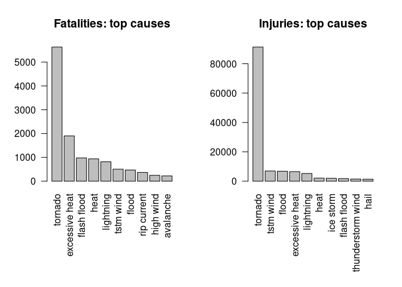

*Most recent update: 2021-12-26*

## Synopsis
*Immediately after the title, there should be a synopsis which describes and 
summarizes your analysis in at most 10 complete sentences.*

## Data Processing
*There should be a section titled Data Processing which describes (in words and 
code) how the data were loaded into R and processed for analysis. In particular, 
your analysis must start from the raw CSV file containing the data. You cannot 
do any preprocessing outside the document. If preprocessing is time-consuming 
you may consider using the `cache = TRUE` option for certain code chunks.*


```r
# data.table is required for one function only, "fread". We won't load the
# entire package because its namespace overlaps some other functions we use.
suppressPackageStartupMessages(library(tidyverse))
suppressPackageStartupMessages(library(lubridate))
```


```r
df <- as_tibble(data.table::fread(file = "repdata_data_StormData.csv.bz2"))
df <- rename(df, state_num = STATE__, longitude_e = LONGITUDE_)
names(df) <- tolower(names(df))
# these variables are all 0 and all NA, respectively
df <- select(df, -c(county_end, countyendn))

# standardize `evtype` to lowercase, removing spaces at beginning and end
# and removing extra internal spaces
df$evtype <- tolower(str_squish(df$evtype))
```

### Correcting `propdmgexp` and `cropdmgexp`

Damage amounts are represented in an unusual way. They are expressed in
scientific notation, with the base and exponent stored in separate variables.

The exponents,
`propdmgexp` and `cropdmgexp`, contain unusual values. They are supposed to
represent a power of 10, which is multiplied by `propdmg` or `cropdmg`
respectively to express a final damage amount.


```r
sort(union(unique(df$propdmgexp), unique(df$cropdmgexp)))
```

```
##  [1] ""  "-" "?" "+" "0" "1" "2" "3" "4" "5" "6" "7" "8" "B" "h" "H" "k" "K" "m"
## [20] "M"
```

After some investigation, it appears varying data entry standards or data
entry error has resulted in this state of affairs. A power of 10 will be
assigned to replace each of these symbols.
(*For a more complete discussion, see [this Rpubs document](https://rstudio-pubs-static.s3.amazonaws.com/58957_37b6723ee52b455990e149edde45e5b6.html).*)

* `empty string`: 0
* `+` or `?`: 1
* `0-9`: 10
* `hH`: 100     "hundred"
* `kK`: 1000    "kilo"
* `mM`: $10^6$   "million"
* `bB`: $10^9$  "billion
* `-`: NA 


```r
# Perform the substitution described above
old <- c("-", "?", "+", "0", "1", "2", "3", "4", "5", "6", "7", "8", "B", "H", "K", "M", "")
new <- c(NA,   1,   1,   10,  10,  10,  10,  10,  10,  10,  10,  10, 1e9, 1e2, 1e3, 1e6, 0)

ctmp <- toupper(df$cropdmgexp)
ptmp <- toupper(df$propdmgexp)
cnew <- rep(NA_integer_, length(ctmp)) # new vectors will be integers
pnew <- rep(NA_integer_, length(ptmp))

for (i in 1:length(old)) {
    cnew[ctmp == old[[i]]] <- new[[i]]
    pnew[ptmp == old[[i]]] <- new[[i]]
}

df$cropdmgexp <- cnew
df$propdmgexp <- pnew
rm(ctmp, ptmp, cnew, pnew)
```


## Results
*There should be a section titled Results in which your results are presented.*

        

### Across the United States, which types of events (as indicated in the EVTYPE variable) are most harmful with respect to population health?

**Variables of interest**

* `evtype`
* `fatalities` and `injuries`


```r
top_fatalities <- df %>% 
    group_by(evtype) %>% 
    summarise(fatalities = sum(fatalities)) %>% 
    arrange(desc(fatalities)) %>% 
    slice_head(n = 10)

top_injuries <- df %>% 
    group_by(evtype) %>% 
    summarise(injuries = sum(injuries)) %>% 
    arrange(desc(injuries)) %>% 
    slice_head(n = 10)
```


```r
par(mfrow = c(1,2), mar=c(c(9, 4, 4, 2) + 0.1))

barplot(top_fatalities$fatalities, names.arg = top_fatalities$evtype, las=2,
        main="Fatalities")
barplot(top_injuries$injuries, names.arg = top_injuries$evtype, las=2,
        main="Injuries")
```

<!-- -->

```r
par(mfrow = c(1,1), mar=c(5, 4, 4, 2) + 0.1)
```

In terms of both fatalities and injuries, **tornadoes are the most destructive
events to human health** in this dataset. 

However, knowing something of 
destructive US weather events, one must ask **"Where are the hurricanes?"**

There is an important note in the FAQ:

>The fatalities, injuries, and damage amounts appearing in tropical cyclone events are
attributed only to wind damage experienced in the coastal counties/parishes listed. Other
tropical cyclone related events such as tornadoes and flooding are listed within their
separate event types.

**i.e. the deaths caused by hurricanes are split up into multiple evtypes**
and will show up as part of floods, lightning, wind, etc. Hurricane-spawned
tornadoes are also included in the tornado events graphed above.

### Across the United States, which types of events have the greatest economic consequences?

**Variables of Interest**

* `evtype`
* `propdmg`, `cropdmg`, `propdmgexp`, `cropdmgexp`
